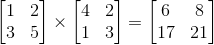

## matrixMultiplication

**Difficulty**: Medium 

## Prompt

Write a function called `matrixMultiplication` that accepts two n-dimensional, *square* matrices (in the form of JS arrays), multiplies them together and returns the resulting array. 

A matrix is represented by a multi-dimensional array. A square matrix is an array of length *c* that is comprised of arrays of length *c*.

For example below are two *square* matrices.

```js
[                           [  
    [1, 2],     AND             [4, 2],
    [3, 5]                      [1, 3]
]                           ]
```

If you do not know how to multiply two matrices together (i.e., compute the dot product) please read this: https://en.wikipedia.org/wiki/Matrix_multiplication#Definition.

An example of matrix multiplication is below:



## Example

```js
matrixMultiplication( [ [1,2], [3,5] ], [ [4,2], [1,3] ] ) //=> [ [6,8], [17,21] ]
matrixMultiplication( [ [2] ], [ [5] ] ) //=> [ [10] ]
```